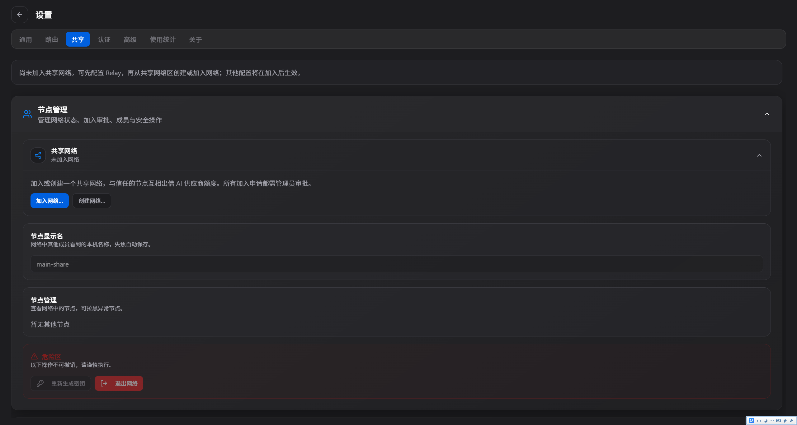
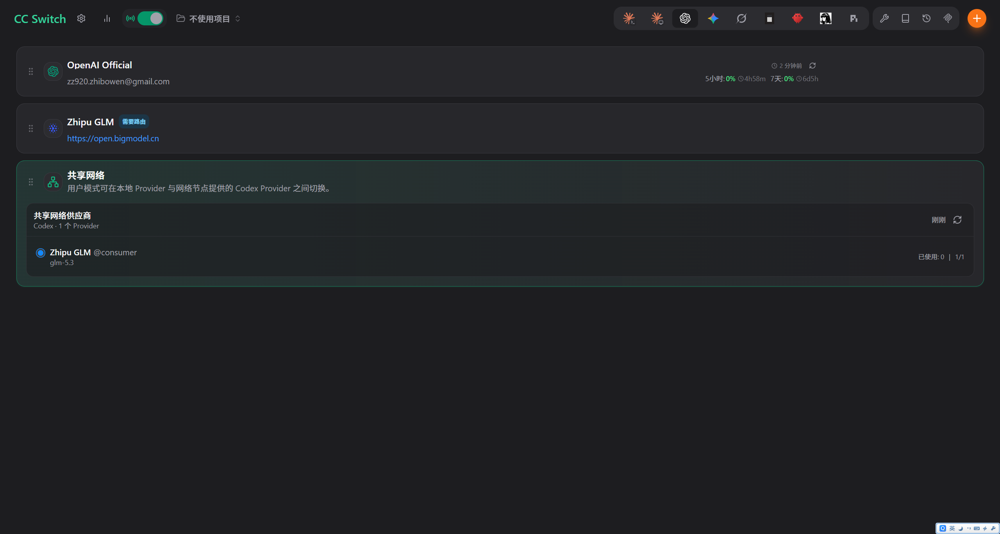

# cc-switch-remote

[](https://linux.do/)

> 基于 [cc-switch](https://github.com/farion1231/cc-switch)（MIT License, Copyright (c) 2025 Jason Young）二次开发。

**cc-switch-remote** 在 cc-switch 的供应商管理与本地路由能力之上，新增 **share id 组网**：
多个客户端通过 share id 组成 P2P 网络，把本地 Claude Code / Codex 等 CLI 的请求
路由到网络内其他成员的机器上，消费对方共享出来的供应商额度。

请求永远由**出借方本机**向上游服务商发出（出站身份模型）——服务商全程只看到
出借方的机器与凭据；消费方的 API Key 从不离开消费方本机。

```
消费方 CLI ──本机代理──► P2P 加密隧道（QUIC / IPv6 直连 / relay 中继）──► 出借方本机代理 ──► 上游服务商
```

## 组件

| 目录 | 说明 |
|---|---|
| `src-tauri/` | 桌面应用（Tauri 2 + React）：供应商管理、本地路由接管、组网、配额 |
| `relay/` | 信令/中继服务器（独立 crate）：rendezvous 服务端 + circuit relay v2，供自建 relay 用 |

桌面客户端**默认连接官方 relay**（`tokentap.top`），无需自建任何服务端即可组网。
`relay/` 面向需要自建信令基础设施的高级用户，构建与部署见 [relay/README.md](relay/README.md)。

## 快速上手

### 作为提供方（出借供应商）

1. 打开 **设置 → 共享网络**，点击 **创建网络**
2. 获得 8 位 share id（如 `4JM8-4DXS`），把它告诉你的朋友
3. 在 **共享与配额** 区域勾选你想出借的供应商
4. 可选：设置 token 配额（按天/月）和每节点限额



### 作为接收方（使用他人的供应商）

1. 打开 **设置 → 共享网络**，输入对方给你的 share id，点击 **加入**
2. 等待提供方审批通过
3. 在供应商列表中找到 **共享网络** 区域，选择要使用的远端供应商
4. 在 Agent 的路由中切换到该供应商即可正常使用



### 共享 OpenAI Official（ChatGPT 订阅）

OpenAI Official 是唯一支持共享的 Official 供应商：

1. 在提供方机器上，通过认证中心完成 ChatGPT 账号登录（Device Code 流程）
2. 编辑 OpenAI Official 供应商，在表单中选择要绑定的托管账号
3. 保存后，共享设置中该供应商即可勾选出借

接收方使用时**无需任何配置**——模型由提供方的 ChatGPT 账号动态决定，
Codex CLI 会使用自身默认模型并随其版本升级。

> **其他 Official 供应商暂不支持共享**：Claude Official、Gemini Official、
> Grok Official 因凭据模型差异（OAuth scope / 请求签名与账号绑定方式不同），
> 当前版本无法安全地跨机器出借，列表中显示为"不可共享"。

## 常见问题

**Q：提供方能看到我的请求内容吗？**

A：**能**。这是"流量出借"的固有属性——提供方需要用自己的凭据向上游发起请求，
因此对你的请求和响应内容完全可见。请只与你信任的人组网，不要在涉及敏感或
机密信息的机器上使用共享功能。

**Q：我的 API Key 会被分享出去吗？**

A：**不会**。你的凭据永远保存在你自己的机器上，不会通过网络传输给提供方。
提供方收到的是经过净化的请求（已移除所有消费方凭据），并注入自己的凭据
向上游发起全新的请求。

**Q：两个节点无法互相发现怎么办？**

A：确认双方都连接到同一个 relay（默认为 `tokentap.top`），并且网络 ID 输入正确。
如果使用自定义 relay，检查地址格式是否包含正确的 PeerId。部分企业网络可能
屏蔽 UDP 流量，此时会自动降级到 TCP 中继。

**Q：如何停止共享？**

A：在共享设置中取消勾选供应商即可立即停止。退出网络会断开所有连接。
你也可以单独拉黑某个节点。

## 组网工作方式

1. **创建网络**的一方获得一个 8 位 share id（如 `4JM8-4DXS`）
2. 其他成员凭 share id 申请加入，创建方审批
3. 网络成员选择性地把自己的供应商"出借"给网络（默认什么都不共享）
4. 消费方在本机代理里把某个 Agent 的路由切到网络成员的供应商上
5. 计费走出借方账号；出借方可按天/月设置 token 配额与每节点限额

**安全模型**（务必阅读）：

- 消费方的凭据（API Key / OAuth）**永不出境**，出借方收到的是净化后的请求
- 出借方注入自己的凭据向上游发起全新请求
- **信任边界**：出借方对其转发的请求/响应内容完全可见（这是"流量出借"的固有属性）。
  请只与你信任的人组网；涉及公司/客户代码的机器不要加入
- 传输层全程加密（QUIC-TLS / Noise）；relay 服务器无法解密端到端内容

## 构建

桌面端（要求 Node 20+、pnpm、Rust ≥ 1.83，Windows 需 VS C++ Build Tools）：

```bash
pnpm install --frozen-lockfile
pnpm tauri build --bundles nsis        # Windows (.exe)
pnpm tauri build --bundles deb,appimage  # Linux
pnpm tauri build --bundles dmg         # macOS
```

relay 服务端：

```bash
cd relay && cargo build --release
```

## 与 cc-switch 的关系

cc-switch-remote 感谢 [cc-switch](https://github.com/farion1231/cc-switch) 及其贡献者。
上游的供应商管理、MCP、Skills、多应用支持等能力完整保留；本仓库的增量改动集中
在 P2P 组网（`share/` 模块）与凭据存储安全加固。上游的完整功能介绍请移步其 README。

## 免责声明 / Disclaimer

本项目按 "AS IS" 提供，不附带任何明示或默示的保证。使用者需自行承担使用风险：

- **账号风险**：共享供应商额度可能违反上游服务商（OpenAI、Anthropic、智谱等）的
  服务条款，可能导致账号被封禁或限制。请在使用前阅读并遵守相关条款
- **数据暴露**：组网出借方对其转发的请求/响应内容完全可见（见上方安全模型），
  请勿在涉及敏感或机密信息的机器上使用共享功能
- **合规使用**：请确保你的使用方式符合所在司法辖区的法律法规

This project is provided "AS IS", without warranty of any kind. Sharing
provider quota may violate upstream providers' terms of service and lead
to account suspension. The lending party has full visibility into relayed
traffic. Use at your own risk and in compliance with your local laws.

## License

MIT（见 [LICENSE](LICENSE) 与 [NOTICE](NOTICE)）。
